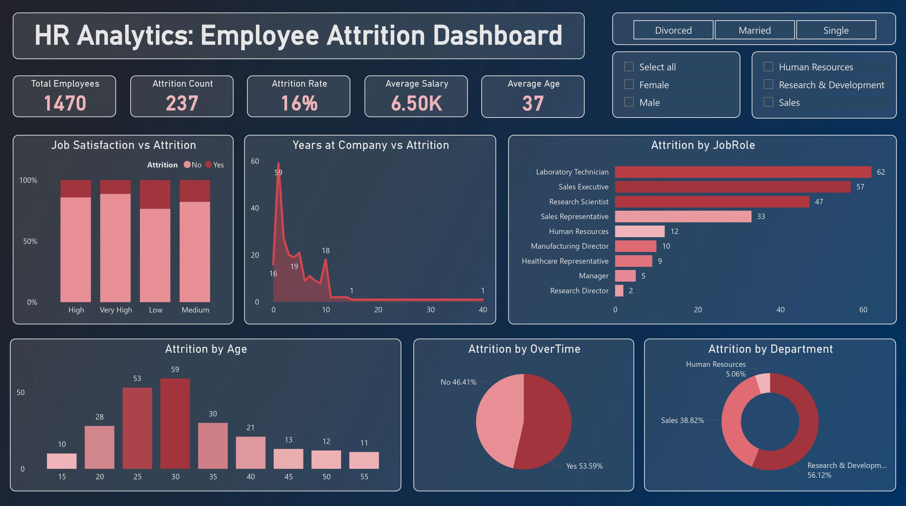

# 📊 HR Analytics: Employee Attrition Dashboard

This project involves a deep-dive analysis of HR data to understand workforce dynamics and identify the root causes of employee attrition. Using **Microsoft Power BI**, I built an interactive dashboard that helps HR managers monitor key metrics and take data-driven actions to improve employee retention.

---

## 🚀 Live Interactive Dashboard

Explore the full interactive report here:
### ➡️ [Click to View Live Dashboard](https://app.powerbi.com/view?r=eyJrIjoiNTI2ZDE4NWQtZTIyZC00YzI4LTg0NWItODFjNThlZmQwNjE3IiwidCI6Ijg4NDk5MWYzLTBjNjktNDMzYi04MDA2LTVjMGFhM2IwNTkwNCIsImMiOjEwfQ%3D%3D)

---

## 📸 Dashboard Preview

---

## 🎯 Project Objective

The goal of this analysis was to answer critical business questions:
1.  **Why are employees leaving?** (Identifying key drivers of attrition).
2.  **Who is leaving?** (Demographic and job role analysis).
3.  **What is the impact?** (Understanding the correlation between overtime, age, and turnover).

---

## 💡 Key Insights & Findings

- **High Risk Age Group:** Employees aged **29-31** show the highest attrition rate, indicating a retention risk among young professionals.
- **Role-Specific Turnover:** 'Sales Executives' and 'Laboratory Technicians' have the highest turnover rates compared to other roles.
- **The Overtime Factor:** Data reveals a strong correlation between **Overtime** and attrition. Employees working overtime are significantly more likely to leave.
- **Overall Attrition:** The company's current overall attrition rate stands at **16%**.

---

## 🛠️ Tools & Techniques Used

- **Microsoft Power BI:** For data visualization and dashboarding.
- **Power Query:** - Data cleaning and transformation.
    - Created **Conditional Columns** to map numerical values (1, 2, 3) to meaningful text (Low, Medium, High) for Satisfaction and Education levels.
- **DAX (Data Analysis Expressions):** - Calculated complex measures like `Attrition Rate %`, `Total Employees`, and `Attrition Count`.
    - Used `CALCULATE` and `DIVIDE` functions for accurate KPI tracking.
- **Data Modeling:** Established a star schema for efficient query performance.

---

## 📂 Dataset

- **Source:** IBM HR Analytics Employee Attrition & Performance (Kaggle).
- **Description:** The dataset contains 1470 rows and includes fields like Education, Job Role, Monthly Income, Years at Company, etc.

---

## 🚀 How to Use This Repository

1.  Download the **`.pbix`** file to view the raw Power BI project.
2.  Check the **snapshots** folder for high-quality images of the dashboard.
3.  Read the analysis summary above to understand the business context.

---

### 👤 Author

**Jahid Hasan** Aspiring Data Analyst | Software Engineering Student  
[LinkedIn](https://linkedin.com/in/jahidstm) | [GitHub](https://github.com/jahidstm)
