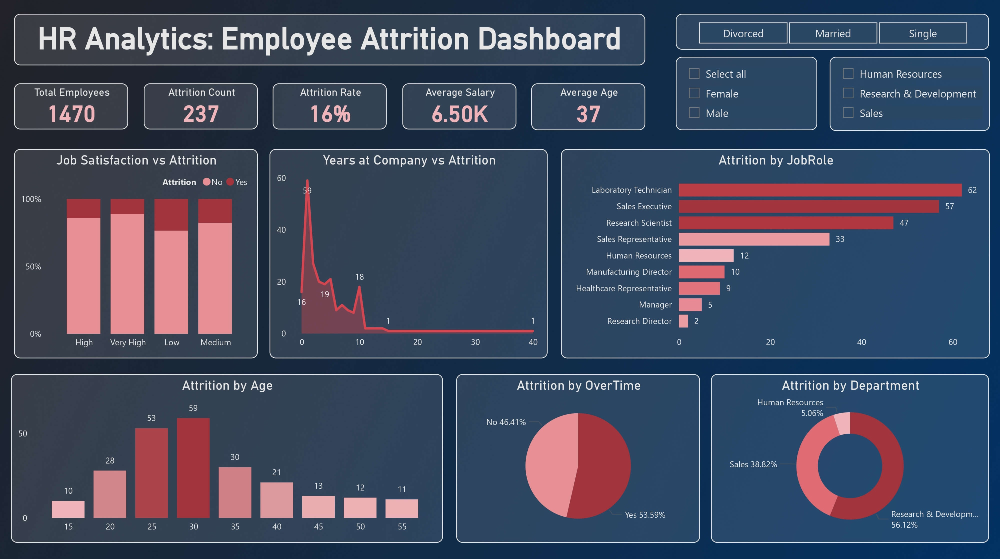

# HR Analytics — Employee Attrition Dashboard

An interactive Microsoft Power BI dashboard for exploring employee attrition by demographics, job role, overtime, satisfaction, income, and tenure.

> **Project status:** Completed dashboard files are included. A hosted Power BI report link is listed below; availability is controlled by the external Power BI service.

[Open the live Power BI report](https://app.powerbi.com/view?r=eyJrIjoiNTI2ZDE4NWQtZTIyZC00YzI4LTg0NWItODFjNThlZmQwNjE3IiwidCI6Ijg4NDk5MWYzLTBjNjktNDMzYi04MDA2LTVjMGFhM2IwNTkwNCIsImMiOjEwfQ%3D%3D)

## Dashboard preview

## Problem and analysis scope

The dashboard is intended to help HR users ask who is leaving, which roles and age groups show higher attrition, and how overtime and other employee attributes relate to turnover. It includes KPI measures, slicers, and visuals built in Power BI.

## Methods and tools

- Power Query transformations, including categorical mappings.
- DAX measures for total employees, attrition count, and attrition rate.
- A star-schema model for the report.
- Microsoft Power BI and the included `.pbix` report.

## Dataset

The repository includes `WA_Fn-UseC_-HR-Employee-Attrition.csv`, described in the project as the IBM HR Analytics Employee Attrition & Performance dataset. The CSV contains 1,470 rows and employee attributes such as education, job role, monthly income, and years at company. The repository does not include a formal citation or source URL; consult the dataset publisher before redistribution.

## Use the files

1. Download `Employee-Attrition-Dashboard.pbix`.
2. Open it in Power BI Desktop.
3. If prompted, point the report to the included CSV and refresh the model.
4. Use the report filters and visuals to explore the analysis.

## Reported observations

The original project notes higher observed attrition among ages 29–31, Sales Executives and Laboratory Technicians, and employees working overtime, plus an overall attrition figure of 16%. These are observations from this supplied dataset/report, not general workforce conclusions; no independent validation is included.

## Limitations and license

This is a retrospective dataset/report and does not establish causation or predict individual outcomes. It is not a live HR system. No `LICENSE` file is present, so license status is **not specified**.

## Author

Jahid Hasan — [GitHub](https://github.com/jahidstm) · [LinkedIn](https://www.linkedin.com/in/jahidstm/)
